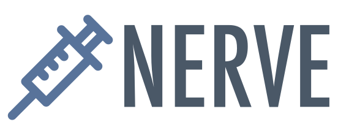

   
  
   
   
  

    NERVE (New Enhanced Reverse Vaccinology Environment) is an open-source, reverse vaccinology environment, with which you can analyze bacterial proteomes to get the best protein vaccine candidates (PVCs).
  

  

    Visit our website to start your free analysis now: https://nerve-bio.org
  

